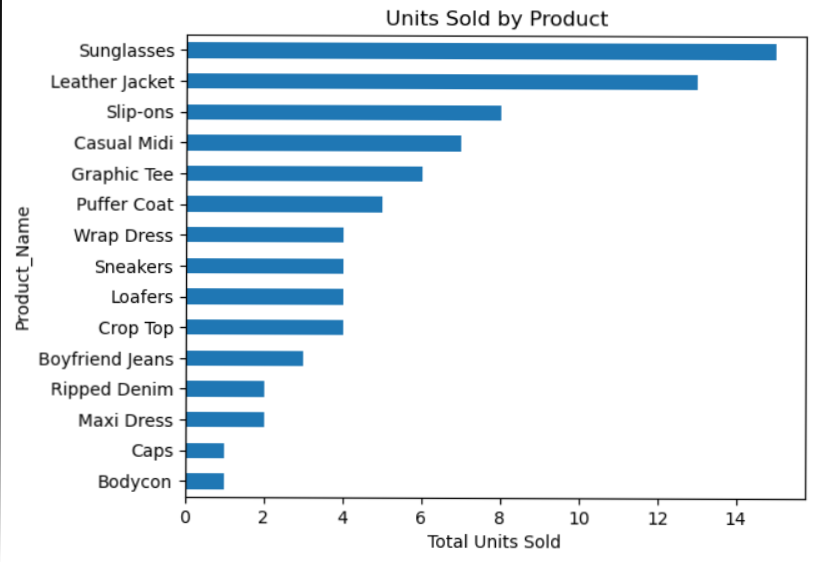
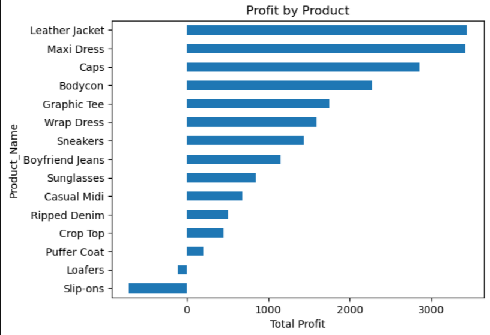
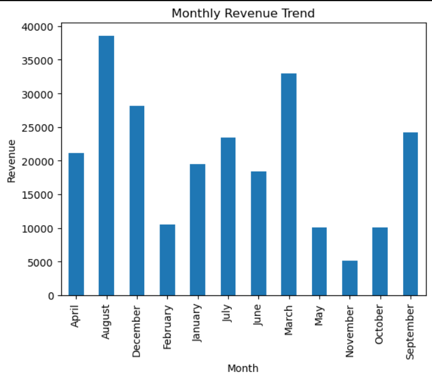
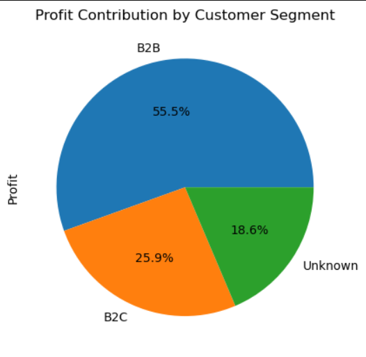
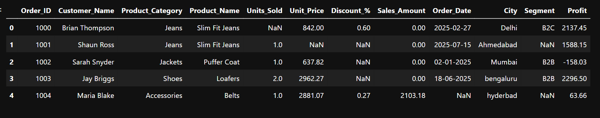
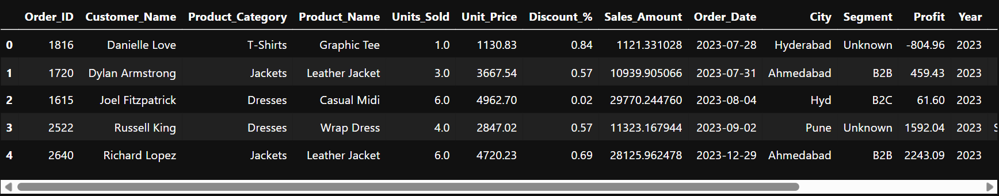

# Retail Sales Data Cleaning & Analysis (Snitch Fashion)

This project walks through a complete workflow of cleaning and analyzing a **retail fashion sales dataset**.
The focus is not just on running `pandas` functions, but on thinking like a data analyst:

- What part of the raw data is actually trustworthy?
- Which rows represent real completed sales vs refunds or incomplete orders?
- How do we turn the cleaned data into business-level insights?

---

## 1. Project Objectives

- Audit a messy sales dataset and expose data-quality problems.
- Recover missing values where it is logically safe (using existing fields like `Sales_Amount`).
- Split the data into:
  - **Valid sales transactions**
  - **Refund / return records**
  - **Pending / incomplete rows**
- Build a **clean, analysis-ready subset** of valid sales.
- Generate KPIs and visual insights for product performance, seasonality and customer segments.

---

## 2. Dataset

Source: Snitch fashion sales CSV (training / practice dataset).

Key columns:

- `Order_ID` – transaction identifier  
- `Customer_Name` – customer  
- `Product_Category`, `Product_Name` – item details  
- `Units_Sold` – quantity  
- `Unit_Price` – selling price per unit  
- `Discount_%` – discount applied (percentage)  
- `Sales_Amount` – billed amount  
- `Order_Date` – transaction date  
- `City` – location  
- `Segment` – B2B / B2C / Unknown  
- `Profit` – profit for that transaction  

The raw file contains **heavy missing values** and some negative/zero quantities and amounts.

---

## 3. Workflow Summary

The analysis is implemented in `notebooks/sales_data_cleaning.ipynb`.

### 3.1 Initial Audit

- Loaded raw data and inspected `.head()`, `.info()`, `.isnull().sum()`.
- Found large gaps in `Units_Sold`, `Unit_Price`, `Discount_%`, and `Order_Date`.
- Confirmed that `Sales_Amount` and `Profit` were always populated.

### 3.2 Type Fixes & Basic Cleaning

- Converted `Order_Date` to `datetime` with `errors="coerce"`.
- Converted `Order_ID` to string (identifier, not numeric).
- Filled missing `Discount_%` with `0` (assumed “no discount”).

### 3.3 Recovering Missing Values

Where possible:

- Recomputed `Unit_Price` from  
  `Sales_Amount / Units_Sold` when `Unit_Price` was missing.
- Recomputed `Units_Sold` from  
  `Sales_Amount / Unit_Price` when `Units_Sold` was missing.

No random imputation – only values that could be derived logically were filled.

### 3.4 Row Segmentation

To keep the analysis honest, the dataset was split into three parts:

- **`valid_sales`**  
  - `Units_Sold > 0`, `Unit_Price > 0`, `Sales_Amount > 0`  
  - Used for all KPI and visualization work.

- **`refunds`**  
  - Rows with negative `Units_Sold` or `Sales_Amount`  
  - Represent returns/adjustments (not used for core KPIs, but kept for transparency).

- **`pending` / incomplete**  
  - Rows with zero/invalid quantities or missing key fields like `Order_Date`  
  - Not suitable for revenue/profit reporting.

Only `valid_sales` is treated as the final cleaned fact table.

### 3.5 Final Cleaning on `valid_sales`

- Dropped rows with missing `Order_Date`.
- Recomputed `Sales_Amount` using:
  \[
  \text{Sales\_Amount} = \text{Units\_Sold} \times \text{Unit\_Price} \times (1 - \text{Discount\_%} / 100)
  \]
- Filled missing `Segment` with `"Unknown"`.
- Sorted transactions by `Order_Date` and reset the index.

### 3.6 Feature Engineering

Added:

- `Year` – transaction year  
- `Month` – month name (for seasonality)  
- `Weekday` – day of the week  
- `Revenue_per_Unit` – `Sales_Amount / Units_Sold`

The cleaned data is saved as:

- `data/cleaned_valid_sales.csv`

---

## 4. Key KPIs (from valid sales)

- **Total Revenue:** ~₹242,237  
- **Total Profit:** ~₹19,769  
- **Average Order Value (AOV):** ~₹10,093  
- **Best-selling product (by units):** `Sunglasses`  
- **Most profitable product:** `Leather Jacket`

> Note: The valid subset is small compared to the raw file, which highlights how poor raw data quality can be in real situations.

---

## 5. Visual Insights

All plots are generated in the notebook and exported to `visuals/`.

### 5.1 Units Sold by Product

### 5.2 Profit by Product

### 5.3 Monthly Revenue Trend

### 5.4 Profit by Segment

---

## 6.Before vs After Cleaning

The screenshots below show a quick comparison of the raw dataset vs the final cleaned version.

### 🛑 Before Cleaning (Raw Data)

- Missing values in key columns (Units Sold, Unit Price, Date)
- Inconsistent data types
- Negative or zero values that made analysis unreliable
- No clear segmentation between valid and invalid records

---

### ✅ After Cleaning (Final Usable Dataset)

- Only valid sales retained (positive values and complete fields)
- Missing values handled logically (not blindly dropped)
- Columns standardized and converted to correct data types
- Feature engineering added (`Month`, `Weekday`, `Revenue per Unit`)

---

### 📌 Summary of Transformation

| Metric | Before | After |
|--------|--------|-------|
| Accuracy | ❌ Not analysis-ready | ✅ Clean and valid |
| Missing Values | Many in critical columns | Resolved logically |
| Format | Mixed/dirty values | Standardized & validated |
| Business Use | Impossible to analyze | Ready for reporting & dashboarding |

---

## 7. Business Takeaways

- The business relies on **high-ticket apparel items** (jackets, dresses) for most of its profit.
- Accessories like **Sunglasses** act as **volume drivers** but are not the top profit contributors.
- Strong seasonality exists; planning inventory and marketing around peak months is important.
- B2B customers are the main profit source; B2C can be grown with targeted offers.
- Missing or `"Unknown"` `Segment` values show a need for better data entry and CRM integration.

---
